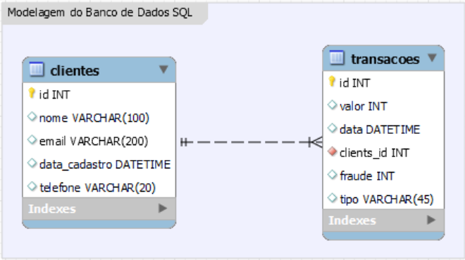
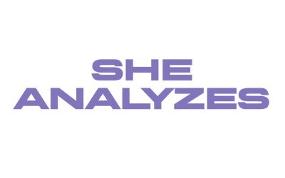
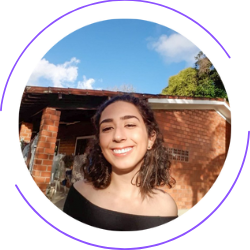

# Accenture - Gama Academy - Mulheres em Tech - Data Engineer/Azure

Este é o Projeto Final do Curso Data Engineer/Azure, desenvolvido pela Accenture em parceria com a Gama Academy!

## Índice

- [Visão geral](#visão-geral)
- [Objetivo](#objetivo)
- [Análise do problema](#análise-do-problema)
- [Funcionalidades](#funcionalidades)
- [Arquivos de entrada](#arquivos-de-entrada)
- [Banco de dados](#banco-de-dados)
- [Tecnologias utilizadas](#tecnologias-utilizadas)
- [Versão em Pandas](#versão-em-pandas)
- [Versão em Spark](#versão-em-spark)
- [Instalação](#instalação)
- [Modelagem de entidades e relacional](#modelagem-de-entidades-e-relacional)
- [Relatórios do Power BI](#relatórios-em-power-bi)
- [Grupo - SheAnalyses](#grupo---sheanalyses)

## Visão geral

Este é um programa escrito em Python. O programa lê arquivos de entrada, carrega os dados em um banco de dados SQL e a partir daí é possível gerar relatórios, utilizando a plataforma PowerBI, para identificar transações suspeitas.

Você poderá encontrar informações detalhadas sobre o desafio [aqui](https://docs.google.com/document/d/10fBZm7Sxm60FEIyNk4rqUE-pJLhXRxDi1grAATF7hVw/edit)!

## Objetivo

O objetivo inicial é analisar os arquivos dados criando uma base de dados relacional para fazer a carga e depois analisá-la. A movimentação bancária fraudulenta será aquela que possuir movimentações abaixo de 2 minutos de espaçamento entre as transações.

## Análise do problema

A análise inicial do problema foi feita a partir da análise dos dados recebidos. A partir daí, foram pensadas em algumas etapas:

* O Brainstorm inicial das etapas pode ser visualizado [aqui]([https://whimsical.com/projeto-final-5zim4iYZrkWQ2Dbpy2knML](https://whimsical.com/projeto-final-5zim4iYZrkWQ2Dbpy2knML)).
* O kanban do projeto com a divisão das atividades pode ser visualizado [aqui]([https://trello.com/b/4JhJb0Iz/project-data-azure-desafio-final](https://trello.com/b/4JhJb0Iz/project-data-azure-desafio-final)).

## Funcionalidades

* Leitura dos arquivos csv.
* Identificação das operações fraudulentas.
* Carregamento dos dados em um banco de dados.
* Análise dos dados obtidos.

## Arquivos de entrada

O programa lê três categorias de arquivos de entrada:

* clients: informações dos clientes, incluindo nome, endereço de e-mail, data de cadastro e telefone.
* transactions-in: informações de transações de entrada para as contas dos clientes, incluindo também valor e data.
* transactions-out: informações de transações de saída para as contas dos clientes, incluindo também valor e data.

Os arquivos de entrada podem ser encontrados nos repositórios. Você pode acessá-los [aqui](https://github.com/SheAnalyzes/projeto-final-pandas/tree/master/arquivos_carga_csv).

## Banco de dados

O programa usa um banco de dados SQL para armazenar os dados dos clientes e transações.

O banco de dados foi criado através das ferramentas da Azure.

## Tecnologias utilizadas

Ao analisar a situação do problema, percebe-se que a quantidade de dados a ser processada não é tão grande.

Por isso, o grupo entendeu que a melhor alternativa a ser utilizada seria o Pandas.

Porém, também fizemos uma versão em Spark, para fins de aprendizagem e poder demonstrar o nosso conhecimento na ferramenta.

As tecnologias utilizadas em nossas aplicações foram:

* Python;
* Pandas;
* Spark;
* SQL;
* Ferramentas do Azure;
* Trello

## Versão em Pandas

Para acessar o repositório do projeto em Pandas, acesse [aqui](https://github.com/SheAnalyzes/projeto-final-pandas/).

Você poderá encontrar o passo a passo do projeto no mesmo.

## Versão em Spark

Para acessar o repositório do projeto em Spark, acesse [aqui](https://github.com/SheAnalyzes/projeto-final-spark).

Você poderá encontrar o passo a passo do projeto no mesmo.

## Instalação

Para fazer a instalação das aplicações, siga os passos a seguir:

1. Clone o repositório do projeto específico em seu computador ([Pandas ](https://github.com/SheAnalyzes/projeto-final-pandas)ou [Spark](https://github.com/SheAnalyzes/projeto-final-spark)).
2. Abra o projeto no Microsoft Visual Studio Code ou outra IDE de sua preferência.
3. Certifique-se de ter o Python e o pip instalados em seu sistema.
4. Execute o comando a seguir: `pip install -r requirements.txt`
5. Execute a aplicação dando o comando '*python3 main.py*' em seu terminal.

## Modelagem de entidades e relacional

## Relatórios em SQL

Para acessar o repositório do relatório em SQL, acesse [aqui](https://github.com/SheAnalyzes/projeto-final-sql).

Você poderá encontrar detalhes no mesmo.

## Relatórios em Power BI

Para acessar o repositório do relatório em PowerBI acesse [aqui](https://github.com/SheAnalyzes/projeto-final-powerbi).

Você poderá encontrar detalhes no mesmo.

## Grupo - SheAnalyses

    

| Ana Paula Santos de Queiroz  Linkedin: [/ana-paula-santos-de-queiroz-086807166](https://www.linkedin.com/in/ana-paula-santos-de-queiroz-086807166/) Github: [/Queirozaps](https://github.com/Queirozaps) |  |
| :---------------------------------------------------------------------------------------------------------------------------------------------------------------------------------------------------------------: | :--------------------------------------------: |
|  **Arianna Silveira Santos**    Linkedin: [/arianna-silveira-aa474514b](https://www.linkedin.com/in/arianna-silveira-aa474514b/) Github: [/AriannaSilveira](https://github.com/AriannaSilveira)  |  |
|                            **Carolina Gois**  Linkedin: [/carolina-gois](https://www.linkedin.com/in/carolina-gois/) Github: [/carolgois](https://github.com/carolgois)                            |  |
|                   **Emilly Correa Santiago**  Linkedin: [/emillysantiago23](https://www.linkedin.com/in/emillysantiago23/) Github: [/emillysant](https://github.com/emillysant)                   |  |
|                              **Mariana Freire**  Linkedin: [/maricf](https://www.linkedin.com/in/maricf/) Github: [/marianafreire](https://github.com/marianafreire)                              |  |
|             **Priscila Assumpção Fernandes**  Linkedin: [/priscila-af](https://www.linkedin.com/in/priscila-af/) Github: [/priscilaassumpcao](https://github.com/priscilaassumpcao)             |  |
|                    **Vivian Medina**  Linkedin: [/vivian-medina-b7250961](https://www.linkedin.com/in/vivian-medina-b7250961/) Github: [/medinavi](https://github.com/medinavi)                    |  |
